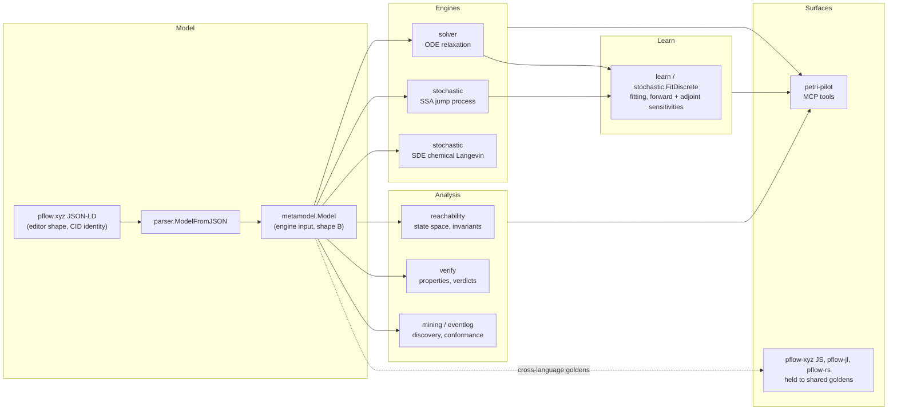

# go-pflow

A Petri-net dynamical modeling engine in Go. You declare one model — places,
transitions, arcs, rates — and go-pflow runs it under three simulation
semantics from that single declaration: a deterministic mass-action **ODE**
relaxation, an exact **SSA** jump process (Gillespie), and a chemical-Langevin
**SDE** with the net's own intrinsic firing noise. Around the engines sit
system identification and parameter fitting (gradient-free, and gradient-based
with forward or adjoint sensitivities), structural analysis and verification
(reachability, P/T-invariants, declarative properties with proved / refuted /
unknown verdicts and counterexamples), and a cross-language compatibility
contract: byte-exact SSA and editor-shape parse goldens held against the
[pflow.xyz](https://pflow.xyz) JavaScript engine, with
[pflow-rs](https://github.com/pflow-xyz/pflow-rs) replaying the SSA half and
[pflow-jl](https://github.com/pflow-xyz/pflow-jl) replaying both on a branch
not yet merged to its default (see [Compatibility](#compatibility) for the
full matrix).

For the long form, read **[the book](https://book.pflow.xyz)**; for why the
byte-exact contract exists, the
[four-language SSA writeup](https://blog.stackdump.com/posts/byte-exact-across-four-languages).

## What go-pflow is, and is not

**It is**

- a Go library: the modeling and runtime core of the pflow ecosystem;
- one declared net, three engines — `stochastic.Solve` dispatches to ODE, SSA
  or SDE, and refuses combinations it cannot honour rather than guessing
  (see [Which engine for which question](docs/engine-selection.md));
- a fitting toolkit that learns rates while preserving structure — every fitted
  parameter is a transition rate, and the fitted model is still analyzable;
- a verification toolkit whose verdicts carry a method (`structural`,
  `exhaustive`, `witness`, `partial`) and, on refutation, a replayable trace
  (see [Model correctness](docs/MODEL-CORRECTNESS.md));
- the reference reading of the pflow.xyz editor format.

**It is not**

- an AI/ML library. It implements structural, dynamical computation based on
  Petri nets and differential equations. `learn` fits mechanistic models, not
  opaque ones; see [Why Petri Nets?](https://book.pflow.xyz/ch01-why-petri-nets.html);
- an MCP server. MCP orchestration — the `petri_*` tools an agent calls — lives
  in [petri-pilot](https://github.com/pflow-xyz/petri-pilot), which imports
  this library;
- a service. Nothing here listens on a port by default;
- the editor. [pflow.xyz](https://pflow.xyz) is the editor; this repo parses
  what it saves.

## Architecture



## Two JSON shapes, one rule

| shape | role |
|---|---|
| **pflow.xyz JSON-LD** (`@context: https://pflow.xyz/schema`; places and transitions keyed by id, `source`/`target`, per-color vectors, `inhibitTransition`, CID as `@id`) | the editor's wire and identity format. Every saved model is addressed by a CID over it, so it does not change. |
| **metamodel** (arrays of `{id}`, `from`/`to`, `type: read\|inhibitor`, `kinetic`, `rate`, `schedule`, `stages`, `parameters`) | the only shape the engines and analyses read. |

The rule: an editor document reaches an engine through exactly one converter,
`parser.ModelFromJSON`. Colors unfold to `place.color`, an output-side
inhibitor becomes an explicit read arc, per-color capacity is summed. The
seven goldens under `parser/testdata/editor-shape/` pin that reading
(`go run ./cmd/shape-goldens` regenerates them). pflow-xyz keeps byte-identical
copies as `parity/editor-shape/` and replays them in CI from
`public/petri-shape_test.ts`; pflow-jl keeps the same bytes as
`test/testdata/editor-shape/` and replays them from `test/test_editor_shape.jl`,
but on its `algebraic-petri` branch — not yet on its default branch, `main`.
pflow-rs has no editor-shape parser yet; it replays the SSA goldens, plus (a
separate contract) go-pflow's ODE parity corpus and the generated-learn
goldens.

## Installation

```bash
go get github.com/pflow-xyz/go-pflow
```

## Quick start

The canonical end-to-end example is the café:

```bash
go run ./examples/cafe
```

It walks one model through the whole stack — declare, observe, fit, ODE / SSA /
SDE, compare the engines, sensitivities, verify — and ends at the same model
the petri-pilot MCP tools serve. It reuses the café fixtures from the
[pflow showcase](https://github.com/pflow-xyz/pflow-xyz/tree/main/examples/showcase)
rather than inventing a toy. Which engine to believe on which question is
[docs/engine-selection.md](docs/engine-selection.md); the capability table is
[docs/solver-matrix.md](docs/solver-matrix.md).

The smallest program that shows the dispatch:

```go
m := &metamodel.Model{
    Name: "sir",
    Places: []metamodel.Place{
        {ID: "S", Initial: 990}, {ID: "I", Initial: 10}, {ID: "R"},
    },
    Transitions: []metamodel.Transition{
        {ID: "infect", Rate: 0.0005}, {ID: "recover", Rate: 0.1},
    },
    Arcs: []metamodel.Arc{
        {From: "S", To: "infect"}, {From: "I", To: "infect"}, {From: "infect", To: "I", Weight: 2},
        {From: "I", To: "recover"}, {From: "recover", To: "R"},
    },
}

for _, method := range []stochastic.Method{stochastic.MethodODE, stochastic.MethodSSA, stochastic.MethodSDE} {
    res, err := stochastic.Solve(m, nil, stochastic.Options{
        Method: method, Horizon: 40, Samples: 81, Realizations: 100, Seed: 42,
    })
    if err != nil {
        log.Fatal(err)
    }
    fmt.Println(res.Method, "final R:", res.Final["R"], "caveats:", res.Caveats)
}
```

The three answers agree on the mean here because no input arc has weight above
one and nothing gates a firing. Add a read arc, an inhibitor or a reached
capacity and the ODE and SDE paths set `Diverged` and say why instead of
returning a smooth curve for a constrained system.

The `petri` builder and `solver` remain the direct ODE path when you have no
metamodel:

```go
net, rates := petri.Build().
    Place("S", 999).Place("I", 1).Place("R", 0).
    Transition("infect").Transition("recover").
    Arc("S", "infect", 1).Arc("I", "infect", 1).Arc("infect", "I", 2).
    Arc("I", "recover", 1).Arc("recover", "R", 1).
    WithCustomRates(map[string]float64{"infect": 0.3, "recover": 0.1})

prob := solver.NewProblem(net, net.SetState(nil), [2]float64{0, 100}, rates)
sol := solver.Solve(prob, solver.Tsit5(), solver.DefaultOptions())
fmt.Println("Final state:", sol.GetFinalState())
```

See [The go-pflow Library](https://book.pflow.xyz/ch19-go-pflow-library.html) for the full API guide.

## Packages

| Package | Purpose | Book chapter |
|---------|---------|--------------|
| `metamodel` | The engine input schema; `NewBundle` composes typed subnets into a `*Bundle`, and `Bundle.Flatten` lowers it to one `Model` | [Ch 4: Token Language](https://book.pflow.xyz/ch04-token-language.html) |
| `parser` | pflow.xyz JSON-LD import/export; `ModelFromJSON` is the one editor-shape → metamodel converter | [Ch 17: Visual Editor](https://book.pflow.xyz/ch17-visual-editor.html) |
| `petri` | Core net types, colors, fluent Builder | [Ch 1: Why Petri Nets?](https://book.pflow.xyz/ch01-why-petri-nets.html) |
| `solver` | ODE solvers (Tsit5, RK45, implicit), equilibrium detection | [Ch 3: Discrete to Continuous](https://book.pflow.xyz/ch03-discrete-to-continuous.html) |
| `stochastic` | `Solve` dispatch; Gillespie SSA, schedules, chemical-Langevin SDE, `FitDiscrete` CTMC likelihood fitting. `Options{Portable: true}` is byte-exact with pflow-rs and pflow-xyz, and with pflow-jl on its `algebraic-petri` branch (goldens in `stochastic/testdata/portable/`, `make ssa-goldens`) | [Ch 3: Discrete to Continuous](https://book.pflow.xyz/ch03-discrete-to-continuous.html) |
| `learn` | ODE parameter fitting and system identification: Nelder-Mead, Adam, forward and adjoint sensitivities, tied parameters, hybrid MLP rates | [Ch 19: go-pflow Library](https://book.pflow.xyz/ch19-go-pflow-library.html) |
| `sensitivity` | Parameter sensitivity analysis | [Ch 19: go-pflow Library](https://book.pflow.xyz/ch19-go-pflow-library.html) |
| `derive` | Evaluation variants of a declared net | — |
| `reachability` | Discrete state space, deadlock/liveness, Farkas P/T-invariants, unboundedness witnesses | [Ch 2: Mathematics of Flow](https://book.pflow.xyz/ch02-mathematics-of-flow.html) |
| `verify` | Declarative property checking — proved / refuted / unknown + counterexample | [Model correctness](docs/MODEL-CORRECTNESS.md) |
| `validation` | Structural validation with located errors and suggested fixes | [Ch 13: Topology-Driven Verification](https://book.pflow.xyz/ch13-topology-driven-verification.html) |
| `eventlog`, `mining`, `monitoring` | Event log parsing, process discovery and conformance, real-time prediction and SLA alerts | [Ch 11: Process Mining](https://book.pflow.xyz/ch11-process-mining.html) |
| `hypothesis` | Move evaluation for game AI | [Ch 6: Game Mechanics](https://book.pflow.xyz/ch06-game-mechanics.html) |
| `statemachine`, `workflow`, `actor` | Statecharts, task dependencies and SLAs, message-passing actors — all on a Petri-net backend | [Ch 10: Complex State Machines](https://book.pflow.xyz/ch10-complex-state-machines.html) |
| `tokenmodel` (+ `dsl`, `petri`, `subnet`, `windowing`, `dataflow`) | Token model schemas, S-expression DSL, Beam-style streaming pipelines | [Ch 4: Token Language](https://book.pflow.xyz/ch04-token-language.html) |
| `codegen/solidity`, `templates` | Solidity generation from token models; common net patterns | [Ch 18: Code Generation](https://book.pflow.xyz/ch18-code-generation.html) |
| `prover`, `zkcompile` | Groth16 proofs of state transitions with gnark; net → circuit compilation | [Ch 12: Zero-Knowledge Proofs](https://book.pflow.xyz/ch12-zero-knowledge-proofs.html) |
| `eventsource`, `graphql`, `results`, `compat` | Event sourcing, GraphQL over models, structured simulation output, bridge between the two Petri implementations. `schema/` beside them is JSON Schema and JSON-LD assets, not a Go package | [Ch 16: Declarative Infrastructure](https://book.pflow.xyz/ch16-declarative-infrastructure.html) |
| `visualization`, `plotter`, `cache`, `stateutil` | SVG rendering, time-series plots, simulation memoization, state-map utilities | [Ch 19: go-pflow Library](https://book.pflow.xyz/ch19-go-pflow-library.html) |

## Examples

`examples/cafe` is the one to start with. The rest each map to a book chapter;
see [examples/README.md](examples/README.md) for the full table, run commands
and a complexity progression.

| Example | Domain | Book chapter |
|---------|--------|--------------|
| [basic](examples/basic/) | Token flow fundamentals | [Ch 1](https://book.pflow.xyz/ch01-why-petri-nets.html) |
| [coffeeshop](examples/coffeeshop/) | Resource modeling, actors, workflows | [Ch 5](https://book.pflow.xyz/ch05-resource-modeling.html) |
| [neural](examples/neural/), [dataset_comparison](examples/dataset_comparison/) | Parameter fitting, calibration | [Ch 3](https://book.pflow.xyz/ch03-discrete-to-continuous.html) |
| [tictactoe](examples/tictactoe/), [connect4](examples/connect4/), [nim](examples/nim/) | Game AI, move evaluation | [Ch 6](https://book.pflow.xyz/ch06-game-mechanics.html) |
| [sudoku](examples/sudoku/), [chess](examples/chess/), [knapsack](examples/knapsack/) | Constraint satisfaction, optimization | [Ch 7](https://book.pflow.xyz/ch07-constraint-satisfaction.html), [Ch 8](https://book.pflow.xyz/ch08-optimization.html) |
| [poker](examples/poker/) | Complex state machines | [Ch 10](https://book.pflow.xyz/ch10-complex-state-machines.html) |
| [mining_demo](examples/mining_demo/), [monitoring_demo](examples/monitoring_demo/), [incident_simulator](examples/incident_simulator/) | Process mining, SLA prediction | [Ch 11](https://book.pflow.xyz/ch11-process-mining.html) |
| [erc](examples/erc/) | Token standards, Solidity codegen | [Ch 4](https://book.pflow.xyz/ch04-token-language.html) |

## The book

**[book.pflow.xyz](https://book.pflow.xyz)** covers everything from foundations to advanced topics:

**Part I: Foundations** — [Why Petri Nets](https://book.pflow.xyz/ch01-why-petri-nets.html), [Mathematics of Flow](https://book.pflow.xyz/ch02-mathematics-of-flow.html), [Discrete to Continuous](https://book.pflow.xyz/ch03-discrete-to-continuous.html), [Token Language](https://book.pflow.xyz/ch04-token-language.html)

**Part II: Applications** — [Resource Modeling](https://book.pflow.xyz/ch05-resource-modeling.html), [Game Mechanics](https://book.pflow.xyz/ch06-game-mechanics.html), [Constraint Satisfaction](https://book.pflow.xyz/ch07-constraint-satisfaction.html), [Optimization](https://book.pflow.xyz/ch08-optimization.html), [Enzyme Kinetics](https://book.pflow.xyz/ch09-enzyme-kinetics.html), [Complex State Machines](https://book.pflow.xyz/ch10-complex-state-machines.html)

**Part III: Advanced** — [Process Mining](https://book.pflow.xyz/ch11-process-mining.html), [Zero-Knowledge Proofs](https://book.pflow.xyz/ch12-zero-knowledge-proofs.html), [Topology-Driven Verification](https://book.pflow.xyz/ch13-topology-driven-verification.html), [On-Chain ZK Verification](https://book.pflow.xyz/ch14-on-chain-verification.html), [Exponential Weights and Scoring Systems](https://book.pflow.xyz/ch15-exponential-weights.html), [Declarative Infrastructure](https://book.pflow.xyz/ch16-declarative-infrastructure.html)

**Part IV: Building** — [Visual Editor](https://book.pflow.xyz/ch17-visual-editor.html), [Code Generation](https://book.pflow.xyz/ch18-code-generation.html), [go-pflow Library](https://book.pflow.xyz/ch19-go-pflow-library.html), [Dual Implementation](https://book.pflow.xyz/ch20-dual-implementation.html)

**Epilogue** — [What the Abstraction Sits On](https://book.pflow.xyz/ch21-epilogue.html)

## Testing

```bash
go test ./...
```

Bazel (hermetic, with `nogo`) also works: `bazel test //...` — see [CLAUDE.md](CLAUDE.md#build-systems).

## CLI

The `pflow` CLI provides simulation, analysis, verification and plotting from the command line. See [cmd/pflow/README.md](cmd/pflow/README.md).

## Compatibility

- Go 1.24.9+ (the `go` directive in `go.mod`; CI builds on 1.24)
- Reads and writes the [pflow.xyz](https://pflow.xyz) JSON-LD format
- SSA goldens (`stochastic/testdata/portable/`, produced under
  `stochastic.Options{Portable: true}`) are replayed byte-for-byte by pflow-xyz
  in JS and by pflow-rs in Rust; pflow-jl replays them on its `algebraic-petri`
  branch, not yet on its default branch
- Editor-shape parse goldens (`parser/testdata/editor-shape/`) are replayed by
  pflow-xyz in JS, and by pflow-jl on `algebraic-petri`; pflow-rs has no
  editor-shape parser yet

## License

MIT License - see [LICENSE](LICENSE) for details.

## Related

- [book.pflow.xyz](https://book.pflow.xyz) — technical book
- [pflow.xyz](https://pflow.xyz) — visual editor and JavaScript engine
- [petri-pilot](https://github.com/pflow-xyz/petri-pilot) — MCP server and code generator over this library
- [pflow-jl](https://github.com/pflow-xyz/pflow-jl), [pflow-rs](https://github.com/pflow-xyz/pflow-rs) — Julia and Rust ports
- [RESEARCH_PAPER_OUTLINE.md](RESEARCH_PAPER_OUTLINE.md) — research paper draft
