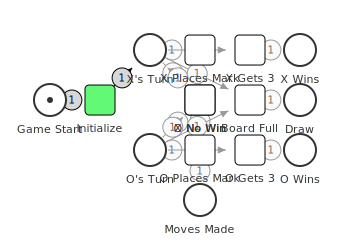

# go-pflow Examples - Model Comparison

This directory contains example implementations demonstrating different aspects of Petri net modeling, ODE simulation, and AI decision-making.

## Overview of Examples

| Example | Type | Complexity | Key Concepts | Visualization |
|---------|------|------------|--------------|---------------|
| **basic** | Workflow | Simple | Sequential processes, producer-consumer patterns | [workflow](basic/workflow_small.svg), [producer-consumer](basic/pc_small.svg) |
| **sudoku** | Puzzle | Simple | Constraint satisfaction, constraint propagation, CSP modeling | [model](sudoku/sudoku_model.svg) |
| **tictactoe** | Game AI | Medium | Minimax, perfect play, ODE-guided decisions | [flow](tictactoe/tictactoe_flow.svg) |
| **nim** | Game Theory | Medium | Discrete state spaces, optimal strategy, position evaluation | [10 stones](nim/nim_10.svg) |
| **connect4** | Game AI | Complex | Pattern recognition, lookahead, multi-dimensional evaluation | [flow](connect4/connect4_flow.svg) |

## Example Details

### 1. Basic Examples

**Location**: `basic/`

**Models**:
- `workflow_small.json` - Linear 3-stage pipeline
- `pc_small.json` - Producer-consumer with buffer

**What It Demonstrates**:
- **Sequential Flow**: Token progression through stages
- **Resource Management**: Producer/consumer coordination
- **Bounded Buffers**: Controlled token accumulation
- **State Transitions**: Simple place-transition dynamics

**Complexity Metrics**:
- Places: 4-5
- Transitions: 2-3
- Arcs: 6-7
- State Space: Linear (workflow) or cyclic (producer-consumer)

**Key Learning**:
- Foundation of Petri nets
- How tokens flow through transitions
- Resource contention and synchronization
- Conservation of tokens in closed systems

**Run Example**:
```bash
cd basic
pflow simulate workflow_small.json
pflow simulate pc_small.json
```

---

### 2. Sudoku Puzzle

**Location**: `sudoku/`

**Model Type**: Constraint satisfaction problem

**What It Demonstrates**:
- **Constraint Modeling**: Representing Sudoku rules as Petri net structure
- **Constraint Propagation**: Using transitions to eliminate invalid possibilities
- **CSP Solving**: Naked singles and hidden singles techniques
- **State Space**: Reachable markings represent valid partial solutions

**Complexity Metrics**:
- Places: 162 (9 cells × 9 digits × 2 types: possibility + assigned)
- Transitions: 81 (one per cell-digit assignment in a 3×3 box model)
- Arcs: 810 (constraint propagation connections)
- State Space: Exponential but heavily constrained

**Key Learning**:
- Modeling constraint satisfaction problems with Petri nets
- Constraint propagation as token flow
- Puzzle generation and solving techniques
- Backtracking search as state space exploration

**Run Example**:
```bash
cd sudoku
go build -o sudoku ./cmd

# Run a demo puzzle
./sudoku

# Analyze the constraint model
./sudoku --analyze

# Generate puzzles
./sudoku --generate --difficulty easy
./sudoku --generate --difficulty hard

# Solve a hard puzzle
./sudoku --solve

# Verbose mode
./sudoku --v
```

**Visualization**: 

---

### 3. Tic-Tac-Toe

**Location**: `tictactoe/`

**Model Type**: Game tree with perfect information

**What It Demonstrates**:
- **Minimax Algorithm**: Perfect play through exhaustive search
- **Game Tree Exploration**: Complete lookahead to terminal states
- **Pattern Recognition**: Win detection (3 in a row)
- **ODE-Based AI**: Using Petri net simulation to guide move selection
- **Solved Game**: Always ends in draw with optimal play

**Complexity Metrics**:
- Board Size: 3×3 = 9 positions
- State Space: 5,478 legal positions
- Game Tree: 255,168 total paths
- Average Game Length: 9 moves
- Branching Factor: 9 → 1 (decreases each turn)

**AI Strategies**:

| Strategy | Algorithm | vs Random | vs Pattern | vs Minimax | Computational Cost |
|----------|-----------|-----------|------------|------------|-------------------|
| Random | Random choice | 50% | 10% | 8% | O(1) |
| Pattern | Win/block/center/corner | 90% | 50% | 25% | O(9) |
| Minimax | Complete game tree search | 92% | 75% | 50%* | O(9!) |
| ODE | Petri net simulation | 85% | 60% | 40% | O(9 × simulation) |

\* With optimal play from both sides, result depends on move order

**Key Insights**:
1. **Perfect Play**: Minimax guarantees optimal moves
2. **Pattern Heuristics**: Simple rules (center, corners) work surprisingly well
3. **ODE Application**: Petri net simulation provides move evaluation
4. **Solved Game**: First player draws with perfect play

**Game Theory**:
- Tic-tac-toe is a **solved game**
- Optimal play always results in a draw
- First player has slight advantage (can force draw)
- 138 terminal board positions (91 X wins, 44 O wins, 3 draws with optimal play)

**Run Example**:
```bash
cd tictactoe
go build -o ttt ./cmd

# Play against minimax AI
./ttt --player-x human --player-o minimax

# Benchmark strategies
./ttt --benchmark --games 100 --player-x pattern --player-o minimax

# Watch minimax evaluation
./ttt --player-x minimax --player-o minimax --v
```

**Visualization**: 

---

### 4. Nim Game

**Location**: `nim/`

**Model Type**: Discrete game state space

**What It Demonstrates**:
- **Game Theory**: Optimal strategy based on Grundy numbers
- **State Space Modeling**: Each stone count is a place
- **Terminal States**: Win/lose conditions
- **AI Strategies**: Random, optimal, ODE-based evaluation
- **Reachability Analysis**: Complete exploration of game tree

**Complexity Metrics** (15 stones):
- Places: 16 (0-15 stones)
- Transitions: 39 (all valid take-1/2/3 moves)
- Arcs: 78 (bidirectional game graph)
- State Space: Linear chain (always progressing toward 0)
- Reachable States: 16 (one per stone count)

**AI Comparison**:

| Strategy | Algorithm | Win Rate vs Random | Computational Cost |
|----------|-----------|-------------------|-------------------|
| Random | Random choice | 25% | O(1) |
| Optimal | Modulo arithmetic | 100% (from winning position) | O(1) |
| ODE | Position scoring | 100% (from winning position) | O(k) where k=max take |

**Key Insights**:
1. **Optimal Strategy**: `n % 4 == 1` positions are losing
2. **ODE Evaluation**: Continuous scoring approximates discrete optimal
3. **Pattern**: Recognizes losing positions without game theory
4. **Bounded**: Game always terminates in ≤15 moves

**Mathematical Beauty**:
- Nim is **solved** - perfect strategy known
- ODE AI learns this pattern through position evaluation
- Demonstrates: discrete decisions from continuous functions

**Run Example**:
```bash
cd nim
go build -o nim ./cmd

# Play against ODE AI
./nim

# Analyze game tree
./nim --analyze --stones 10

# Benchmark strategies
./nim --benchmark --games 1000 --player-x optimal --player-o random
```

---

### 5. Connect Four

**Location**: `connect4/`

**Model Type**: Multi-dimensional pattern recognition

**What It Demonstrates**:
- **Pattern Recognition**: 69 window patterns per board state
- **Threat Detection**: Identifying 3-in-a-row opportunities
- **Blocking Patterns**: Preventing opponent wins
- **Lookahead Search**: Minimax-lite evaluation
- **Strategic Positioning**: Center column advantage
- **Complex State Space**: 7^42 possible boards (though most unreachable)

**Complexity Metrics**:
- Board Size: 7×6 = 42 positions
- Possible Patterns: 69 windows (24 horizontal, 21 vertical, 24 diagonal)
- State Space: ~10^13 legal positions
- Game Length: Typically 20-42 moves
- Branching Factor: 1-7 (decreases as columns fill)

**Pattern Recognition Analysis**:

| Pattern Type | Count | Detection Method | Strategic Value |
|--------------|-------|------------------|-----------------|
| Horizontal 4-windows | 24 | Sliding window | Win/threat detection |
| Vertical 4-windows | 21 | Column scanning | Win/threat detection |
| Diagonal (/) 4-windows | 12 | Diagonal iteration | Win/threat detection |
| Diagonal (\) 4-windows | 12 | Diagonal iteration | Win/threat detection |
| **Total** | **69** | Per-move evaluation | Complete coverage |

**AI Strategy Comparison**:

| Strategy | Pattern Recognition | Lookahead | Win Rate vs Random | Win Rate vs Pattern | Speed (games/sec) |
|----------|--------------------|-----------|--------------------|---------------------|-------------------|
| Random | None | 0-ply | ~25% | 0% | 400,000 |
| Pattern | Explicit (4 levels) | 0-ply | 100% | - | 34,000 |
| ODE | Continuous scoring | 1-ply | 100% | 100% | 16,000 |

**Pattern Scoring Weights**:
```
4 in a row:    10,000 points (immediate win)
3 in a row:       100 points (strong threat)
2 in a row:        10 points (potential)
1 disc:             1 point (presence)
Center column:      3 points (strategic bonus)
```

**ODE Lookahead Formula**:
```
For each possible move m:
  1. Simulate our move → evaluate our_score(m)
  2. Simulate opponent's best response → opp_score(m)
  3. Score(m) = our_score(m) - 0.5 × opp_score(m)
  4. Choose move with maximum Score(m)
```

**Key Insights**:
1. **Pattern Hierarchy**: Not all patterns are equal (winning > threats > potential)
2. **Blocking Priority**: Must block opponent 3-in-a-row before creating own threats
3. **Lookahead Value**: 1-ply lookahead provides 100% win rate vs 0-ply
4. **Center Control**: Geometric advantage of center column
5. **Pattern Blocking**: Opponent's presence invalidates pattern scoring

**Petri Net Model**:
- Models **full board state + win detection** with places for each position
- **130 places**: 42 board positions + 42 X history + 42 O history + 4 control
- **222 transitions**: 84 move transitions + 138 win detection transitions
- **858 arcs**: Complete game rules encoded in structure
- Board positions: P00-P56 (6 rows × 7 columns)
- History tracking: _X00-_X56 and _O00-_O56 places
- **Win detection**: All 69 patterns × 2 players encoded as Petri net transitions
- **Like tic-tac-toe**: Complete game rules in Petri net structure
- Pattern recognition: Win detection in Petri net, move evaluation in Go code
- **Most sophisticated example**: Larger than tic-tac-toe, with full pattern encoding

**Run Example**:
```bash
cd connect4
go build -o connect4 ./cmd

# Play against ODE AI
./connect4

# Watch pattern recognition in action
./connect4 --player-x pattern --player-o pattern --v

# Benchmark AI strategies
./connect4 --benchmark --games 100 --player-x ode --player-o pattern

# Analyze game flow model
./connect4 --analyze
```

---

## Cross-Example Comparison

### Architectural Approaches

The examples use three different approaches to Petri nets:

**1. Petri Net for Simulation Only (basic)**
- **Models**: workflow, producer-consumer
- **Petri Net Role**: Models the actual system being simulated
- **Decision Making**: None (deterministic flow)
- **ODE Simulation**: Used to model token flow over time
- **Example**: Tokens flowing through manufacturing stages

**2. Petri Net + ODE for AI (tictactoe)**
- **Model**: Full board state (places for each position)
- **Petri Net Role**: Represents game state and rules
- **Decision Making**: ODE simulation evaluates each possible move
- **ODE Simulation**: Simulates forward to estimate win probability
- **Pattern Recognition**: Emerges from Petri net structure
- **Example**: Evaluating moves by simulating Petri net transitions

**3. Petri Net Board State + Code AI (connect4, nim)**
- **Model**: Full board state (like tic-tac-toe) but AI in Go code
- **Petri Net Role**: Stores game state, tracks history
- **Decision Making**: Direct Go code implementation
- **Pattern Recognition**: Go code (69 window checks for Connect Four)
- **ODE Simulation**: Not used for AI (could be added)
- **Example**: Board state in Petri net, decisions in code

| Example | Petri Net Usage | AI Implementation | Pattern Recognition | ODE Role |
|---------|----------------|-------------------|---------------------|----------|
| **basic** | Full system model | N/A | N/A | Simulate system |
| **tictactoe** | Full board state (9 positions) | ODE simulation | Via Petri net | Evaluate moves |
| **nim** | Full game state (stones) | Go code | Go code (mod 4) | Visualize only |
| **connect4** | Full board state (42 positions) | Go code | Go code (69 windows) | Visualize only |

**Key Insights**:
- **Tic-tac-toe**: Uses Petri net + ODE simulation for AI (true Petri net AI)
- **Connect Four**: Now stores full board state in Petri net (130 places!), but AI logic is in Go
- **Nim**: Stores game state (stone counts), AI logic is simple modulo arithmetic
- All three games demonstrate different levels of Petri net integration with decision-making

### Complexity Progression

```
basic/workflow_small.json
  ├─ Places: 4
  ├─ Transitions: 3
  ├─ Concepts: Sequential flow
  └─ State Space: Linear (4 states)

tictactoe
  ├─ Model: Game flow (7 places)
  ├─ Real Game: 3×3 board
  ├─ Concepts: Minimax, perfect play
  └─ State Space: 5,478 legal positions

nim (10 stones)
  ├─ Places: 11
  ├─ Transitions: 27
  ├─ Concepts: Game tree, optimal strategy
  └─ State Space: Linear chain (11 states)

connect4
  ├─ Model: Full board state + win detection (130 places)
  ├─ Board: 42 positions + 42 X history + 42 O history + 4 control
  ├─ Transitions: 222 (84 moves + 138 win patterns)
  ├─ Arcs: 858 (complete game rules encoded)
  ├─ Concepts: Board state, pattern recognition, win detection in Petri net
  └─ State Space: ~10^13 legal positions
```

### State Space Characteristics

| Example | State Space Type | Reachable States | Bounded? | Cycles? | Terminal States |
|---------|-----------------|------------------|----------|---------|-----------------|
| **workflow** | Linear | 4 | Yes | No | 1 (Complete) |
| **producer-consumer** | Cyclic | Infinite (unbounded) | No | Yes | 0 (runs forever) |
| **tictactoe** | Tree/DAG | 5,478 | Yes | No | 3 (X wins, O wins, Draw) |
| **nim** | Linear chain | 16 (15 stones) | Yes | No | 1 (0 stones) |
| **connect4** | Tree/DAG | ~10^13 | Yes | No | 3 (X wins, O wins, Draw) |

### AI Decision Making

| Example | Decision Type | State Evaluation | Strategy Complexity |
|---------|--------------|------------------|---------------------|
| **workflow** | None (deterministic) | N/A | N/A |
| **tictactoe** | Board position (1-9) | Minimax game tree | O(9!) worst case |
| **nim** | Discrete choice (1-3) | Position modulo 4 | O(1) |
| **connect4** | Column choice (1-7) | 69 pattern windows | O(patterns × lookahead) |

### ODE Application

| Example | ODE Usage | Continuous → Discrete | Accuracy | Notes |
|---------|-----------|----------------------|----------|-------|
| **workflow** | Simulate token flow | Flow rates → token counts | Exact | Full ODE simulation |
| **tictactoe** | Win probability simulation | Petri net transitions → move value | Good (85% vs random) | **True Petri net AI** |
| **nim** | Visualization only | N/A (uses mod 4 in Go) | Near-optimal | ODE not used for AI |
| **connect4** | Visualization only | N/A (uses Go pattern code) | Dominant | ODE not used for AI |

---

## Concept Progression

### 1. Tokens and Flow (basic)
**Learn**: Petri nets represent state with tokens
- Workflow: Tokens move sequentially
- Producer-consumer: Tokens cycle through system
- **Takeaway**: Tokens = resources, state, or work items

### 2. Constraint Satisfaction (sudoku)
**Learn**: CSP as Petri nets
- Places represent possible values for each cell
- Transitions model value assignments
- Constraint propagation eliminates invalid options
- **Takeaway**: Petri nets model constraint problems naturally

### 3. State Space Exploration (nim)
**Learn**: Complete reachability analysis
- Every stone count is reachable
- Linear progression (no cycles)
- Bounded (game terminates)
- **Takeaway**: Petri nets can model game trees

### 4. Position Evaluation (nim)
**Learn**: Continuous functions guide discrete choices
- ODE scoring: `score = distance_to_losing_position`
- Maps continuous values to discrete moves
- Approximates optimal without explicit game theory
- **Takeaway**: ODEs can solve discrete decision problems

### 5. Pattern Recognition (connect4)
**Learn**: Complex feature extraction
- 69 patterns checked per position
- Weighted combination of features
- Hierarchical importance (win > threat > potential)
- **Takeaway**: Rich pattern spaces enable intelligent behavior

### 6. Lookahead Search (connect4)
**Learn**: Anticipating opponent response
- 1-ply minimax: simulate opponent's best move
- Adjust our evaluation based on their response
- Dramatically improves play quality
- **Takeaway**: Lookahead transforms good AI into dominant AI

---

## Teaching Progression

### Recommended Learning Path

**Beginner** → Start with `basic/`
1. Run `pflow simulate workflow_small.json`
2. Observe token flow through stages
3. Try `pc_small.json` to see cyclic behavior
4. **Learn**: Places, transitions, arcs, tokens

**Beginner+** → Try `sudoku/`
1. Run `./sudoku --v` to see constraint propagation
2. Analyze the model: `./sudoku --analyze`
3. Try different puzzles: `./sudoku --generate --difficulty hard`
4. **Learn**: Constraint satisfaction, puzzle solving

**Intermediate** → Move to `nim/`
1. Build and play: `./nim --player-x human --player-o ode`
2. Analyze game tree: `./nim --analyze --stones 10`
3. Compare strategies: `./nim --benchmark --games 1000 --player-x optimal --player-o ode`
4. **Learn**: State spaces, optimal strategy, position evaluation

**Advanced** → Explore `connect4/`
1. Play with verbose mode: `./connect4 --player-x pattern --player-o pattern --v`
2. Watch pattern scores in real-time
3. Compare AI strategies in benchmarks
4. **Learn**: Pattern recognition, lookahead, strategic depth

---

## Key Differences Summary

### Model Complexity

**Basic** (Workflow):
- **Purpose**: Demonstrate Petri net basics
- **Complexity**: 4 places, 3 transitions
- **Decision Making**: None (deterministic)
- **Best For**: Learning Petri net fundamentals

**Sudoku** (Puzzle):
- **Purpose**: Constraint satisfaction modeling
- **Complexity**: 162 places, 81 transitions (3×3 box model)
- **Decision Making**: Constraint propagation
- **Best For**: Understanding CSP and puzzle solving

**Nim**:
- **Purpose**: Game theory with optimal strategy
- **Complexity**: 16 places, 39 transitions (15 stones)
- **Decision Making**: Position evaluation (mod 4)
- **Best For**: Understanding state spaces and ODE-based decisions

**Connect Four**:
- **Purpose**: Pattern recognition and strategic AI
- **Complexity**: 69 patterns per state, ~10^13 state space
- **Decision Making**: Multi-dimensional pattern evaluation + lookahead
- **Best For**: Advanced AI techniques and complex pattern spaces

### What Each Example Teaches Best

| Concept | Best Example | Why |
|---------|--------------|-----|
| Petri net basics | **basic/** | Simple, visual, deterministic |
| Constraint satisfaction | **sudoku** | CSP modeling, constraint propagation |
| State space analysis | **nim** | Complete reachability, clear terminal states |
| Game theory | **nim** | Optimal strategy is provable |
| ODE-based decisions | **nim** | Clean mapping: continuous score → discrete move |
| Pattern recognition | **connect4** | 69 patterns, hierarchical importance |
| Lookahead search | **connect4** | 1-ply minimax dramatically improves play |
| Strategic complexity | **connect4** | Center control, blocking, threat creation |

### Performance Characteristics

| Example | Build Time | Run Time | State Space | Memory Usage |
|---------|-----------|----------|-------------|--------------|
| **basic** | N/A (JSON) | <1ms | 4 states | KB |
| **nim** | ~1s | <1ms/game | 16 states | KB |
| **connect4** | ~1s | ~60μs/game | ~10^13 states | KB (only current state) |

---

## Using These Examples

### For Learning Petri Nets
Start with **basic/** examples:
- Visual and simple
- Clear token flow
- Foundation concepts

### For Game Theory
Use **nim**:
- Optimal strategy is provable
- Complete state space exploration
- Clean mathematical structure

### For AI Development
Study **connect4**:
- Real-world pattern complexity
- Demonstrates explicit knowledge engineering
- Foundation for ML approaches

### For Research
All three demonstrate:
- ODE simulation of discrete systems
- Reachability analysis
- State space exploration
- Decision-making under uncertainty

---

## Common Patterns Across Examples

### 1. Pattern: State Representation
- **basic**: Tokens in places
- **nim**: One place per stone count
- **connect4**: Board state (not fully modeled in Petri net)

### 2. Pattern: Terminal Conditions
- **workflow**: Stage3 (completion)
- **nim**: Stones_0 (game over)
- **connect4**: Player1Wins, Player2Wins, Draw

### 3. Pattern: Decision Making
- **workflow**: None (deterministic flow)
- **nim**: Choose take amount (1-3)
- **connect4**: Choose column (1-7)

### 4. Pattern: Evaluation
- **nim**: `score = f(stones % 4)`
- **connect4**: `score = Σ(pattern_weights × pattern_counts)`

### 5. Pattern: Search
- **nim**: No search (direct evaluation)
- **connect4**: 1-ply minimax (evaluate opponent response)

---

## Extension Ideas

### Basic Examples
- [ ] Add error handling and retry logic
- [ ] Model resource contention (multiple consumers)
- [ ] Add priority queues

### Nim
- [ ] Multi-pile Nim (XOR strategy)
- [ ] Normal variant (taking last stone wins)
- [ ] Variable max take (4, 5, etc.)
- [ ] Training ML model from ODE AI games

### Connect Four
- [ ] Deeper lookahead (2-ply, 3-ply with alpha-beta)
- [ ] Opening book from common positions
- [ ] Fork detection (multiple threats)
- [ ] Endgame database
- [ ] Neural network pattern evaluation

---

## Performance Benchmarks

### Simulation Speed

| Example | Games/Second | Bottleneck |
|---------|--------------|------------|
| **nim (random vs random)** | ~3,000,000 | Minimal (simple logic) |
| **nim (ode vs ode)** | ~3,000,000 | Position evaluation |
| **connect4 (random vs random)** | ~400,000 | Board state management |
| **connect4 (pattern vs pattern)** | ~34,000 | Pattern counting (69 windows) |
| **connect4 (ode vs ode)** | ~16,000 | Lookahead simulation |

### Scaling Characteristics

**Nim**:
- Linear in number of stones
- O(n) places, O(3n) transitions
- Constant-time AI decisions

**Connect Four**:
- Constant board size (7×6)
- O(patterns) per evaluation = O(69) = O(1)
- O(patterns × moves) per lookahead = O(69 × 7) = O(1)
- Exponential in lookahead depth: O(7^d)

---

## Conclusion

These examples demonstrate the progression from simple sequential processes to complex pattern-based decision making:

1. **basic/** - Foundation: tokens, places, transitions
2. **nim** - Game theory: optimal strategy, state space
3. **connect4** - AI: pattern recognition, lookahead, strategic depth

Together, they showcase how Petri nets model diverse systems and how ODE-based thinking applies to discrete decision problems.

### Key Takeaways

✓ **Petri nets** are versatile: workflows, games, AI
✓ **Reachability analysis** reveals system properties
✓ **ODE-based evaluation** bridges continuous and discrete
✓ **Pattern recognition** enables intelligent behavior
✓ **Lookahead** dramatically improves decision quality

### Next Steps

1. Run all examples to see progression
2. Modify parameters to explore behavior
3. Implement suggested extensions
4. Apply patterns to your own domains
