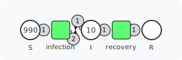
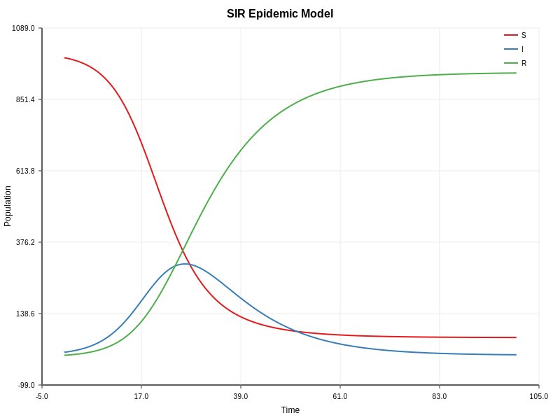

# Basic Example

A simple introduction to go-pflow demonstrating core concepts: Petri net construction, ODE simulation, JSON import/export, and visualization.

## What It Does

1. **SIR Epidemic Model** - Creates and simulates a Susceptible-Infected-Recovered epidemic model using Petri nets with mass-action kinetics
2. **JSON Import/Export** - Demonstrates serializing and deserializing Petri nets to JSON format

## Running

```bash
cd examples/basic
go run main.go
```

## Output

The example generates:
- `sir_petri_net.svg` - Petri net structure visualization
- `sir_model.svg` - ODE simulation results plotted over time

### SIR Petri Net Model



### SIR Simulation Results



## Key Concepts

### Petri Net Structure
- **Places**: S (Susceptible), I (Infected), R (Recovered) hold tokens representing population counts
- **Transitions**: `infection` and `recovery` transform the population
- **Arcs**: Connect places to transitions with weights defining consumption/production

### Mass-Action Kinetics
The ODE solver treats transitions as chemical reactions:
- `S + I → 2I` (infection spreads)
- `I → R` (recovery)

Transition rates (β=0.0003, γ=0.1) control epidemic dynamics.

## Packages Used

- `petri` - Petri net construction
- `solver` - ODE simulation
- `parser` - JSON serialization
- `plotter` - SVG plot generation
- `visualization` - Petri net rendering
