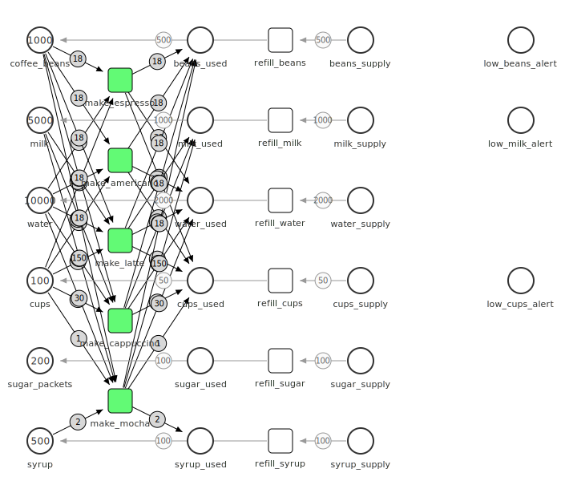
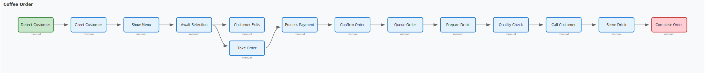
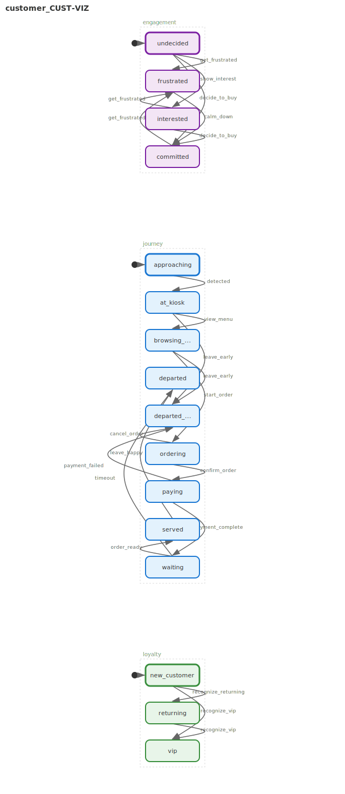

# Coffee Shop Example

A comprehensive "kitchen sink" demonstration of go-pflow's capabilities through a fully automated coffee shop simulation.

## What It Does

This example showcases all major go-pflow features:
- **Actor pattern** for high-level orchestration
- **Petri nets** for ingredient inventory management
- **Workflows** for order processing with SLAs
- **State machines** for equipment and staff states
- **ODE simulation** for capacity planning
- **Reachability analysis** for verification
- **Process mining** for analyzing simulation event logs

## Running

```bash
cd examples/coffeeshop/cmd
go run main.go
```

## Output

Generated visualizations are saved to `output/`:

### Inventory Petri Net



### Order Processing Workflow



### Barista State Machine


### Customer Journey State Machine



### Espresso Machine State Machine


## Demonstrations

The main program runs through several demos:

1. **Petri Net Inventory** - Models ingredient tracking (coffee beans, milk, water, cups, syrup) with reachability analysis
2. **Workflows** - Order processing workflows with different SLAs for regular vs VIP/mobile orders
3. **State Machines** - Parallel region state machines for barista work cycles, espresso machine status, and customer journeys
4. **ODE Simulation** - Capacity planning with full-day simulations including peak hours
5. **Actor Orchestration** - Event-driven shop operations with message passing
6. **Continuous Simulator** - Random customer interactions with configurable scenarios (rush hour, slow day, stress test)

## Key Features

### Inventory Management
- Tracks: coffee beans, milk, water, cups, syrup
- Predicts runout times based on consumption rates
- Supports multiple drink recipes (latte, cappuccino, espresso, etc.)

### Workflow Types
- Regular orders (5 min SLA)
- Mobile/VIP orders (3 min SLA)
- Equipment cleaning workflows

### Simulation Configs
```go
coffeeshop.QuickTestConfig()   // Fast testing
coffeeshop.RushHourConfig()    // High traffic
coffeeshop.SlowDayConfig()     // Low traffic
coffeeshop.StressTestConfig()  // Push limits
```

## Packages Used

- `petri` - Inventory Petri net
- `solver` - ODE simulation
- `workflow` - Order processing
- `statemachine` - Equipment/staff/customer states
- `reachability` - State space analysis
- `visualization` - SVG rendering
- `mining` - Process mining analysis
