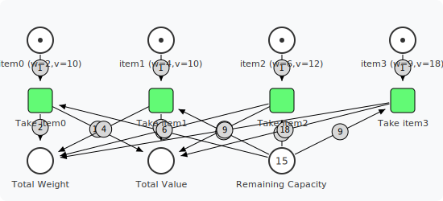
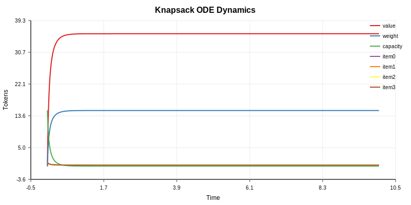

# Knapsack Example

Demonstrates modeling the classic 0/1 Knapsack optimization problem as a Petri net with ODE simulation.

## What It Does

1. Models the knapsack problem where each item can be taken at most once
2. Uses mass-action kinetics to simulate item selection
3. Performs exclusion analysis to measure each item's contribution
4. Compares continuous ODE approximation to discrete optimal

## Running

```bash
cd examples/knapsack/cmd
go run main.go
```

## Problem Definition

```
Items:
  Name    Weight  Value  Efficiency (v/w)
  ------  ------  -----  -----------------
  item0        2     10              5.00
  item1        4     10              2.50
  item2        6     12              2.00
  item3        9     18              2.00

Capacity: 15

Optimal solution: items 0, 1, 3 → weight=15, value=38
```

## Output

### Knapsack Petri Net Model



### ODE Dynamics



## Key Concepts

### Petri Net Structure
- **Item places**: 1 token = available, 0 = taken (enforces 0/1 constraint)
- **Capacity place**: Holds tokens representing available weight budget
- **Take transitions**: Consume item + capacity, produce value + weight tracking

### Mass-Action Kinetics
```
flux = rate × [item] × [capacity]
```
- Items compete for limited capacity
- Arc weights affect consumption amounts
- All items taken proportionally based on availability

### Exclusion Analysis
Disabling each item's transition reveals its contribution:
```
  Excluded   Final Value   Relative
  --------   -----------   --------
  none             35.71   100.0%
  item0            33.81    94.7%
  item1            37.75   105.7%
  item2            37.75   105.7%
  item3            32.00    89.6%
```

Note: item3 has the highest impact when excluded (drops to 89.6%).

### ODE vs Discrete
- **Discrete optimal**: Pick items 0,1,3 → value=38
- **ODE approximation**: Continuous relaxation ≈35.71
- The ODE reveals relative item contributions through dynamics

## Packages Used

- `petri` - Knapsack Petri net model
- `solver` - ODE simulation
- `plotter` - Dynamics plotting
- `visualization` - Model rendering
