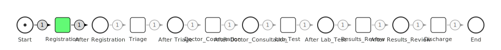

# Monitoring Demo

Demonstrates real-time predictive process monitoring with SLA tracking and alerts.

## What It Does

Simulates a hospital emergency room monitoring system:

1. **Learn from History** - Discovers process model and rates from historical data
2. **Initialize Monitor** - Sets up real-time monitoring with 4-hour SLA threshold
3. **Track Live Cases** - Monitors multiple patients progressing through ER
4. **Predict Completion** - Updates predictions as new events arrive
5. **Alert on Risk** - Triggers warnings for potential SLA violations

## Running

```bash
cd examples/monitoring_demo
go run main.go
```

## Output

### Discovered Process Model



## Scenario

**SLA**: Patients must be discharged within 4 hours

**Simulated Patients**:
- **P101**: Normal case - completes within SLA (3 hours)
- **P102**: Risk case - requires surgery, violates SLA (8 hours)
- **P103**: Fast case - simple prescription (1.25 hours)

## Sample Output

```
[10:00:05] Patient P101 arrived
[10:00:05] Patient P101: Registration (elapsed: 0s)
         └─ Predicted remaining: 3h0m, Risk: 15%

[10:15:05] Patient P101: Triage (elapsed: 15m)
         └─ Predicted remaining: 2h45m, Risk: 12%

🚨 ALERT: SLA_WARNING
   Patient P102 at risk of SLA violation
   Predicted completion: 18:00:05
   Risk score: 85%
```

## Key Concepts

### Monitor Configuration
```go
config := monitoring.DefaultMonitorConfig()
config.SLAThreshold = 4 * time.Hour
config.EnablePredictions = true
config.EnableAlerts = true
```

### Alert Types
- **SLA_WARNING**: Case at risk of violating SLA
- **SLA_BREACH**: SLA already violated
- **CASE_STALLED**: No progress for extended period

### Prediction Updates
As cases progress, predictions refine:
- Early stages: Higher uncertainty
- Later stages: More accurate remaining time
- Risk score: Probability of SLA violation

### Real-Time API
```go
monitor.StartCase("P101", time.Now())
monitor.RecordEvent("P101", "Triage", time.Now(), "Staff")
pred, _ := monitor.PredictCompletion("P101")
monitor.CompleteCase("P101", time.Now())
```

## Use Cases

- **Proactive Intervention**: Identify at-risk cases early
- **Resource Allocation**: Focus staff on high-risk patients
- **Capacity Planning**: Predict future load
- **Performance Improvement**: Identify bottleneck activities

## Packages Used

- `eventlog` - Historical data management
- `mining` - Model discovery and rate learning
- `monitoring` - Real-time tracking, predictions, alerts
- `visualization` - Model rendering
