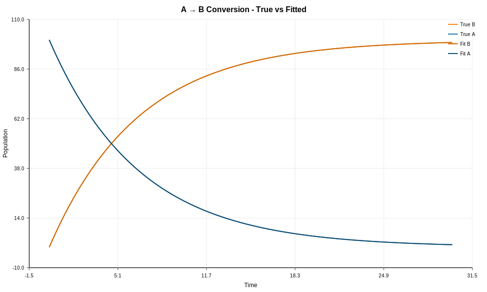
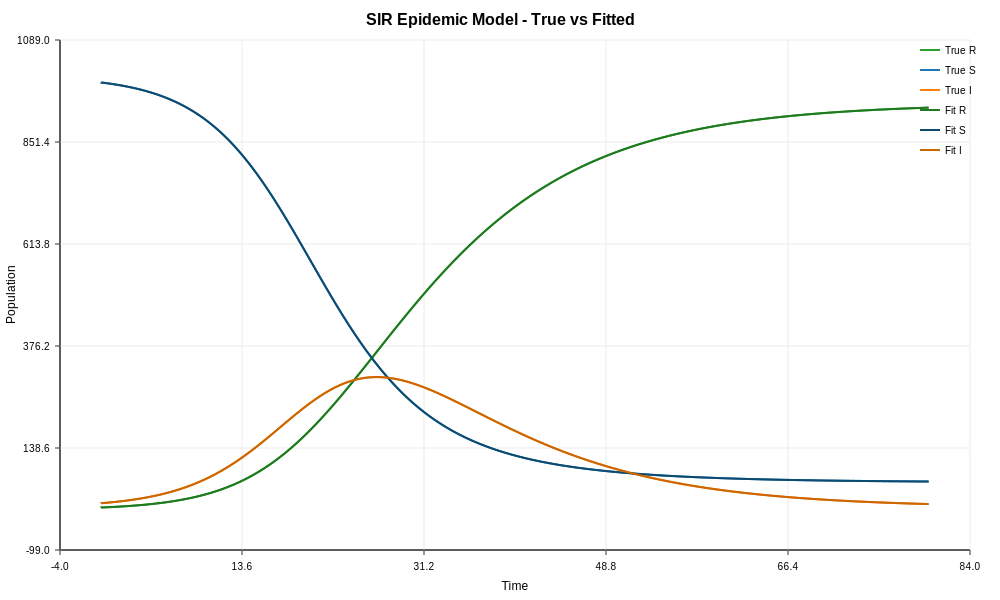

# Neural ODE Example

Demonstrates parameter fitting for Petri net models using gradient-free optimization, similar to Neural ODE approaches.

## What It Does

1. **Simple Decay** - Fits a single rate constant (A → B conversion)
2. **SIR Epidemic** - Fits infection and recovery rates for epidemic model

Both examples:
- Generate synthetic data with known true rates
- Start with incorrect initial guesses
- Use Nelder-Mead optimization to recover true parameters
- Compare fitted trajectories to ground truth

## Running

```bash
cd examples/neural/cmd/main
go run main.go
```

## Output

### Simple A → B Conversion



### SIR Epidemic Model Fitting



## Example 1: Simple Decay

**Problem**: A → B with unknown rate

```
True rate:      0.1500
Initial guess:  0.0500
Fitted rate:    0.1498
Relative error: 0.13%
```

### What's Happening

1. True rate = 0.15 generates synthetic observations
2. Model initialized with rate = 0.05 (3x off)
3. Optimizer minimizes MSE between predicted and observed
4. Recovered rate ≈ 0.15 (within 1%)

## Example 2: SIR Epidemic

**Problem**: Fit β (infection) and γ (recovery) rates

```
Transition    | True Rate | Initial  | Fitted   | Error
------------- | --------- | -------- | -------- | ------
infection     | 0.000300  | 0.000200 | 0.000298 | 0.7%
recovery      | 0.100000  | 0.050000 | 0.099500 | 0.5%
```

### Fitting Process

1. Generate synthetic S, I, R trajectories with known rates
2. Sample 21 data points over t=[0, 80]
3. Initialize with 33% and 50% off from true values
4. Minimize MSE loss across all compartments
5. Recover both rates to <1% error

## Key Concepts

### Learnable Rate Functions
```go
// Constant rate (most common)
rf := learn.NewLinearRateFunc([]string{}, []float64{0.05}, false, false)

// State-dependent rate (advanced)
rf := learn.NewLinearRateFunc([]string{"S", "I"}, []float64{0.0001}, true, false)
```

### Fitting Options
```go
opts := &learn.FitOptions{
    MaxIters:  500,
    Tolerance: 1e-4,
    Method:    "nelder-mead",  // Gradient-free optimizer
}
```

### Loss Functions
```go
// Mean Squared Error (default)
loss := learn.MSELoss(solution, data)

// Custom loss functions also supported
```

### Dataset Creation
```go
times := learn.GenerateUniformTimes(0, 30, 16)
obsA := learn.InterpolateSolution(trueSol, times, "A")
data, _ := learn.NewDataset(times, map[string][]float64{"A": obsA})
```

## Why "Neural ODE-ish"?

Like Neural ODEs, this approach:
- Treats ODE parameters as learnable
- Uses gradient-free optimization (could extend to gradient-based)
- Fits continuous dynamics to discrete observations

Unlike true Neural ODEs:
- Uses mechanistic Petri net structure (not neural network)
- Parameters have physical interpretation (rates)
- More interpretable, fewer parameters

## Packages Used

- `petri` - Model structure
- `solver` - ODE integration
- `learn` - Parameter fitting, loss functions, optimization
- `plotter` - Comparison visualization
