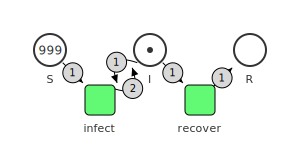
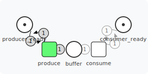
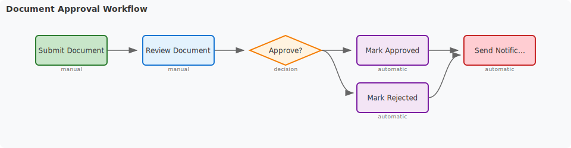
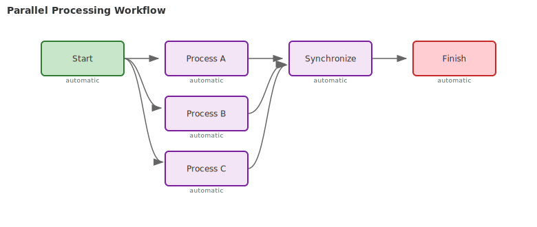
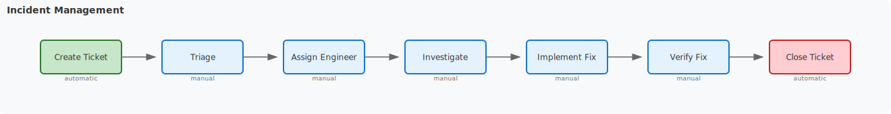
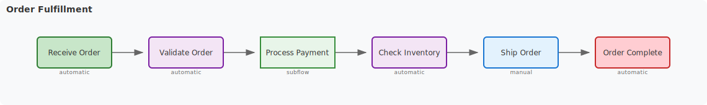
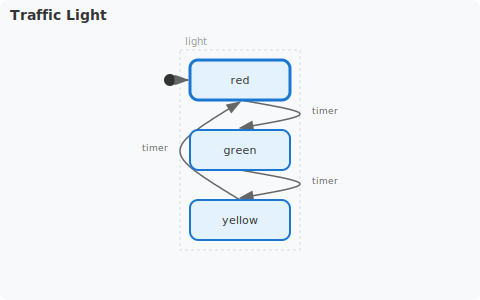
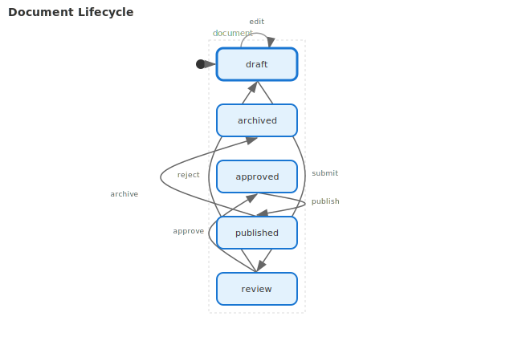

# Visualization Demo

Generates example SVG visualizations for Petri nets, workflows, and state machines.

## What It Does

Creates SVG files demonstrating go-pflow's visualization capabilities:
- **Petri Nets** - SIR epidemic and producer-consumer models
- **Workflows** - Approval, parallel, incident, and order processing
- **State Machines** - Traffic light, order status, media player, network connection, document lifecycle

## Running

```bash
cd examples/visualization_demo
go run main.go
```

## Generated Visualizations

### Petri Net Examples

#### SIR Epidemic Model



#### Producer-Consumer



### Workflow Examples

#### Document Approval



#### Parallel Processing



#### Incident Management



#### Order Fulfillment



### State Machine Examples

#### Traffic Light



#### Order Status


#### Media Player (Parallel Regions)


#### Network Connection


#### Document Lifecycle



## Visualization Types

### Petri Nets
- **Places** (circles): Hold tokens
- **Transitions** (rectangles): Transform state
- **Arcs**: Directed edges with weights
- **Token display**: Shows initial marking

### Workflows
- **Task nodes**: Manual, automatic, decision, subflow types
- **Flow edges**: Show task dependencies
- **Start/End markers**: Entry and exit points
- **Split/Join patterns**: AND/XOR parallel execution

### State Machines
- **States**: Rounded rectangles
- **Transitions**: Labeled arrows with events
- **Regions**: Parallel orthogonal areas
- **Self-loops**: States with transitions back to themselves

## Code Examples

### Petri Net Visualization
```go
net := petri.NewPetriNet()
// ... build net ...
visualization.SaveSVG(net, "my_petri_net.svg")
```

### Workflow Visualization
```go
wf := workflow.New("my-flow").
    Task("start").Automatic().Done().
    Task("end").Automatic().Done().
    Connect("start", "end").
    Build()
visualization.SaveWorkflowSVG(wf, "my_workflow.svg", nil)
```

### State Machine Visualization
```go
chart := &statemachine.Chart{
    Name: "MyMachine",
    Regions: map[string]*statemachine.Region{...},
    Transitions: []*statemachine.Transition{...},
}
visualization.SaveStateMachineSVG(chart, "my_statemachine.svg", nil)
```

## Packages Used

- `petri` - Petri net construction
- `workflow` - Workflow definition
- `statemachine` - State machine charts
- `visualization` - SVG rendering for all model types
